# 6. Settings

## 6.1 Motion 

### 6.1.1 Parameters

**Joint Step:** Set the step length for fine adjustment of single joint rotation in Live-control.  

**Position Step:** Set the step length for fine cartesian position (X/Y/Z) adjustment in Live-control.  

**Attitude Step:** Set the step length for fine adjustment of TCP orientation in Live-control.  

**Collision Detection Sensitivity:** When the deviation of the torque detected by the joint exceeds a certain normal range during the movement of the robotic arm, the robotic arm will automatically stop to prevent the robotic arm or the operator from being injured. The collision sensitivity range is 1 to 5 levels. The larger the value is set, the higher the collision sensitivity level is, and the smaller the additional torque required for the robotic arm to trigger collision protection. If the load or installation direction is not set accurately, it may cause false alarms.   
During certain high loads or high speed movements, if you confirm that the load or installation direction is set accurately, you can try to lower the collision sensitivity, but it is not recommended to lower it to less than 3. 

**Initial Position:** Setting the Initial Position of the robotic arm can help the user to return the robotic arm to a relatively safe position when planning the motion trajectory.

### 6.1.2 TCP
Set TCP Payload and TCP Offset according to the actual situation.

**TCP Payload:** The load weight refers to the actual mass (end-effector + object) in Kg; X/Y/Z-axis represents the position of the centre of gravity of payload in mm, this position is expressed in default TCP coordinate located at flange center (Frame B in the above figure). If there is virtually no load at the end, both TCP payload and centre of gravity must be set to 0.  

**TCP Offset:** Setting the Tool Coordinate Offset with respect to the initial tool frame located at the center of the flange (Frame B in the above figure). The position coordinates X, Y, and Z determine the position of TCP, while Roll, Pitch, and Yaw determine the orientation. When the specified value is zero, TCP coincides with the centre point of the tool output flange.

The current payload of the robotic arm can be set and the additional TCP payload data can be recorded. The additional TCP payload data can be referenced during Blockly programming.

**Default TCP payload：[kg,Cx,Cy,Cz][x,y,z,roll,pitch,yaw]**  
* No Payload: [0,0,0,0]，[0,0,0,0,0,0]
* xArm Vacuum Gripper: [0.61,0,0,53]，[0,0,126,0,0,0]
* xArm Gripper: [0.82,0,0,48]，[0,0,172,0,0,0]
* xArm BIO Gripper: [0.72,22.39,3.22,23.55]，[159.5,0,59.5,0,0,0]
* Robotiq-2F-85 Gripper: [0.925,0,0,58]，[0,0,174,0,0,0]
* Robotiq-27-140 Gripper: [1.025,0,0,73]，[0,0,244,0,0,0]

**Create New TCP Payload and Offset**
* Method 1: Manual Input
  When the TCP offset parameter of the end effector is known, you can choose to manually input its TCP offset parameter. 

  Note: Once the name of the new payload has been determined, it cannot be changed.  
  

* Method 2: Automatic identification.
  The current robotic arm must be mounted on a steady floor if automatic identification is selected. The robotic arm needs to run a series of action commands to calculate the parameters of TCP payload. In addition, it is important to ensure the safety of equipment and personnel near the robotic arm. 
  Teaching 5 points to get the TCP offset.
  

### 6.1.3 Coordinates

**Base Coordinates**  
The user can set the coordinate offset to customize the user coordinate system. X, Y, Z are coordinate values that are offset relative to the base coordinate system. Roll, Pitch, Yaw represents the angular values of orientation relative to the base coordinate system. After this offset setting, user coordinate system becomes the world origin instead of robot base.

**Create a new Coordinates**
* Method 1: Manual Input
* Method 2: Teaching UCS. Obtain the base coordinate offset parameters by teaching 3 points.
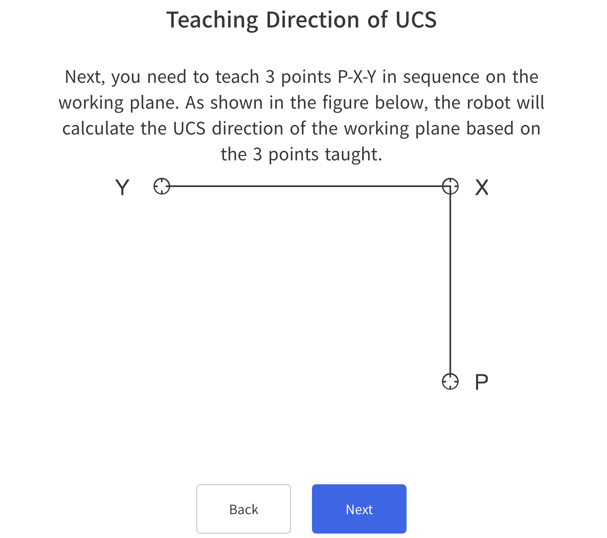

&nbsp;&nbsp;&nbsp;&nbsp;&nbsp;&nbsp;A:Base Coordinate&nbsp;&nbsp;&nbsp;B:Tool Coordinate&nbsp;&nbsp;&nbsp;C:User Coordinate 

**Mounting**
Setting the mounting direction of the robotic arm is mainly to inform the control box of the current relationship between the actual mounting direction of the robotic arm and the direction of gravity. If the mounting direction of the robotic arm is set incorrectly, the robotic arm will not be able to accurately recognize the direction of gravity, which will cause the robotic arm to frequently trigger a collision warning and stop motion, and will also result in uncontrolled motion of the robotic arm after entering manual mode.  
xArm with SN of XF1300/XI1300/XS1300 and later versions, the built-in IMU of the robot arm will detect the direction of gravity. When the deviation between the installation direction you set and the installation direction detected by the IMU exceeds 10°, the software will pop-up prompts.
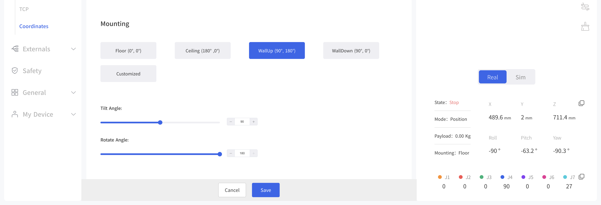

***
How to determine the tilt angle and rotation angle?
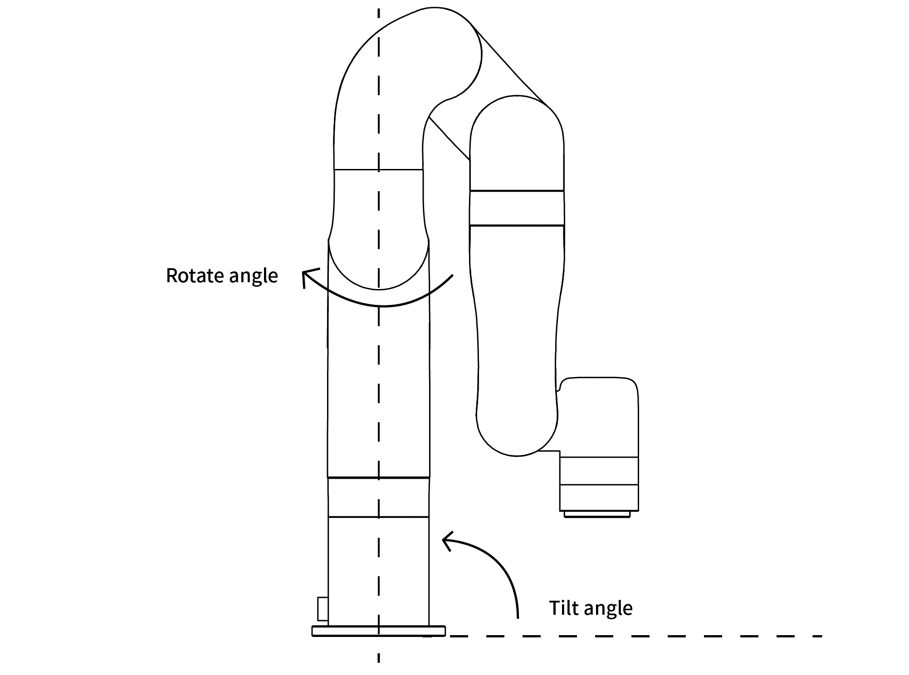

The initial position of the robotic arm: On the horizontal plane, when the user is facing the robotic arm side, the initial position is on the left-hand side of the user in a downward direction.
* **Tilt angle:** The initial position of the robotic arm and the base of the robotic arm to be mounted should be in a tilt angle, which ranges from 0 to 180°.
* **Rotation angle:** The initial position of the robotic arm and the end direction of the robotic arm to be mounted should be used as the rotation angle.  

The method of determining the rotation angle ± direction:
Hold it with your right hand and point your thumb in the direction of the robotic arm which is vertically mounted. The direction where your four fingers point is the positive direction and vice versa. 
The range of rotation angle: ±180° 
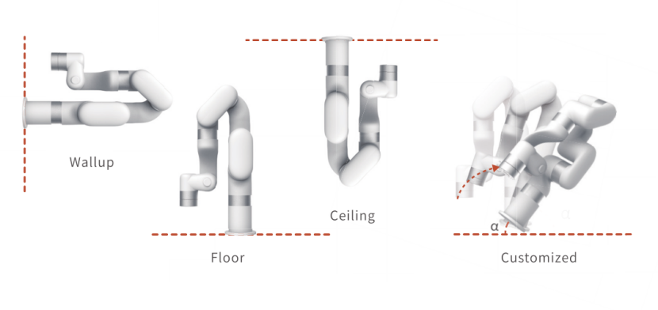

**Danger:**
* Make sure the robotic arm is properly placed according to the actual use.  
* Must be mounted on a sturdy, shock-resistant surface to avoid the risk of rollover of the robotic arm.
***

## 6.2 Externals 

### 6.2.1 End Effector IO
Monitor the digital input and analog input status of the external device to the robot arm, and set the digital output at the end of the robot arm.
Update Frequency: 5HZ.
Digital Input: TI0, TI1, TI2, TI3, TI4, low level by default.
Digital Output: TO0, TO1, TO2, TO3, TO4.
Robot Analog Input: TAI0, TAI1, 0V by default, [0-3.3V].  
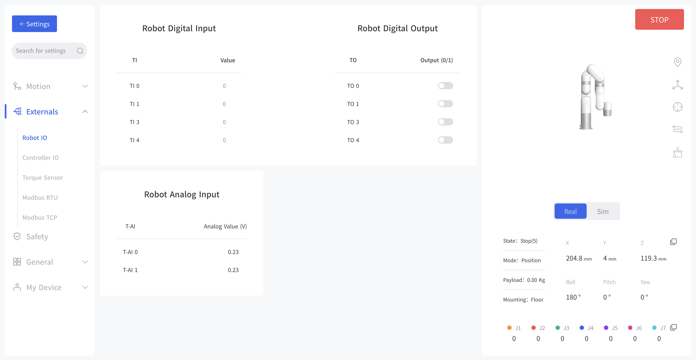

### 6.2.2 Controller IO
The control box of the robotic arm is equipped with 32 digital input and output signals, which can be set in the Blockly project and SDK only when IO is set to General Input/Output, otherwise the custom setting will not take effect.

**IO State**
The IO input status and IO output status of the control box can be monitored, and the IO output status of the control box can be controlled by clicking the button.
Digital Input: CI0-CI7, DI0-DI7, High level by default.
Digital Output: CO0-CO7, DO0-DO7, Low level by default.
Analog Input: AI0, AI1.
Analog Output: AO0, AO1, 0V by default, [0-10V].

**IO Function**
The following functions (if configured), can be triggered by low-level input signals.
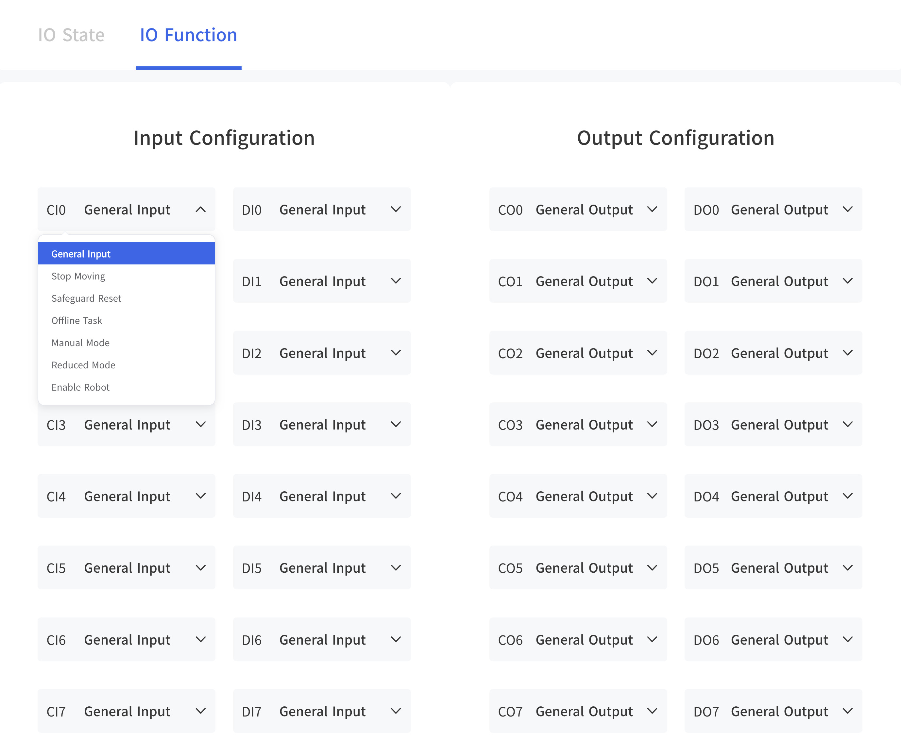  
General Input: The user can use the IO freely in Blockly or SDK program only when the controller input is set as a general input, otherwise it will cause a function conflict. For example, if CI 0 is configured as an offline task, CI 0 should not be used in any program.  
Stop Moving: Trigger IO, the robotic arm stops moving.  
Safeguard Reset: Trigger IO to resume the motion of the robotic arm in the protection stop state. Should work with SI.  
Offline Task: Offline Task can add multiple Blockly to be triggered through I/O.   
Manual Mode: When set as Manual Mode, the robotic arm can be dragged freely when the input signal remains low level.  
Reduced Mode: The IO is triggered and the robotic arm enters the reduced mode.  
Enable Robot: Enable the robotic arm by triggering IO.

**Note**
DI0-DI7 are not equipped with the following three functions: stop moving, safeguard reset, and reduced mode.

### 6.2.3 Torque Sensor
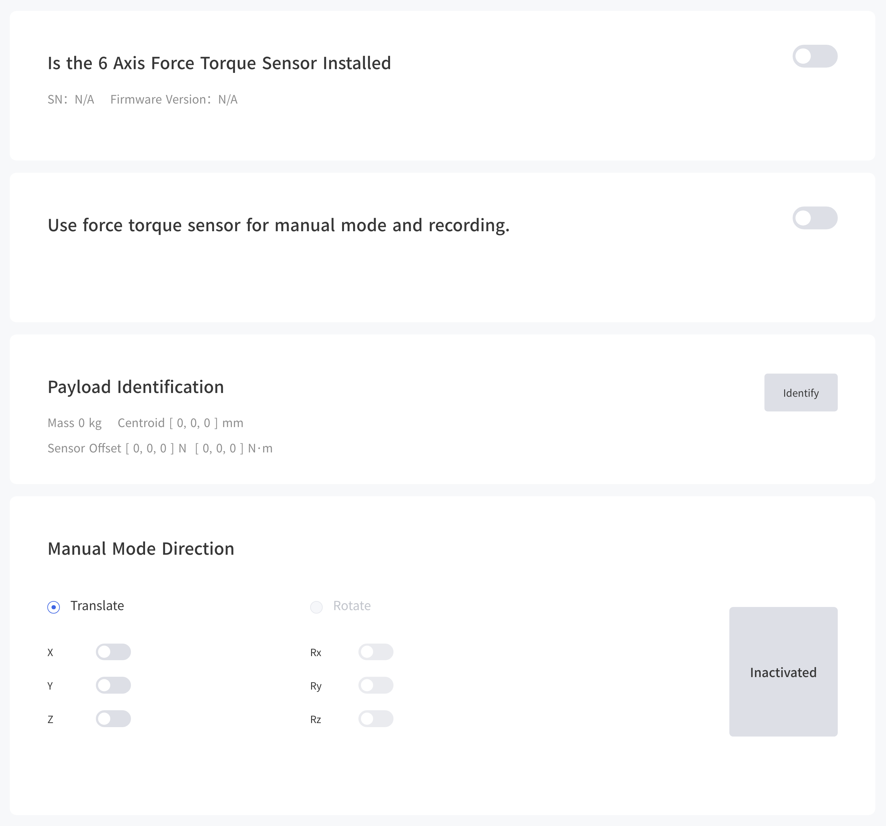
This page allows you to do load recognition of the torque sensor and set the manual mode direction of the torque sensor.

### 6.2.4 Modbus RTU
In the Modbus RTU interface, the user can send commands to control the robot gripper and get the position information of the gripper. 
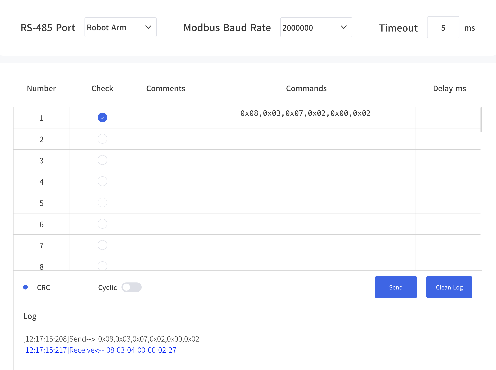 
For example:
* Selects the robot arm Modbus or control box Modbus.
* Sets the baud rate, the default baud rate is 2000000.
* Enter commands in the "Commands" box, for example: 0x08,0x03,0x07,0x02,0x00,0x02, note that the program will do CRC checksum automatically.
* Click Send and you can see the sent and received information in the debug box on the left.

If you want to send in a loop, you need to set the delay time, turn on the loop function and click send.

### 6.2.5 Modbus TCP
This page allows you to send standard Modbus TCP command, the IP is controller ip, port 502, can not be modified.
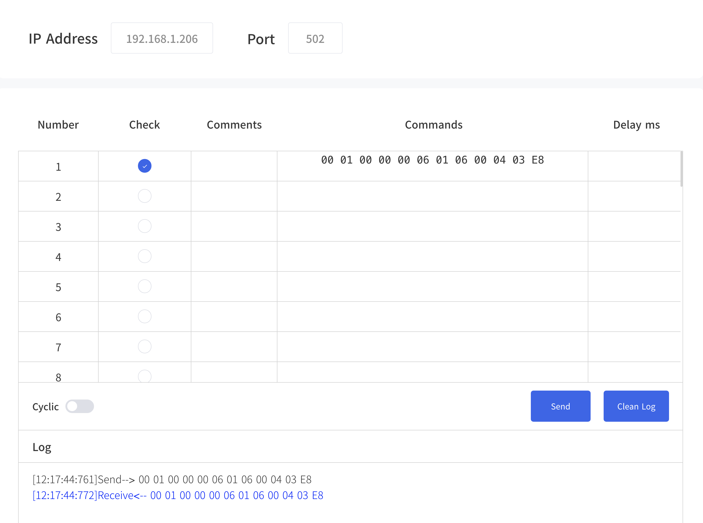
For example: send '00 01 00 00 00 06 01 06 00 04 03 E8', set controller analog output AO1 as 1V.

## 6.3 Safety
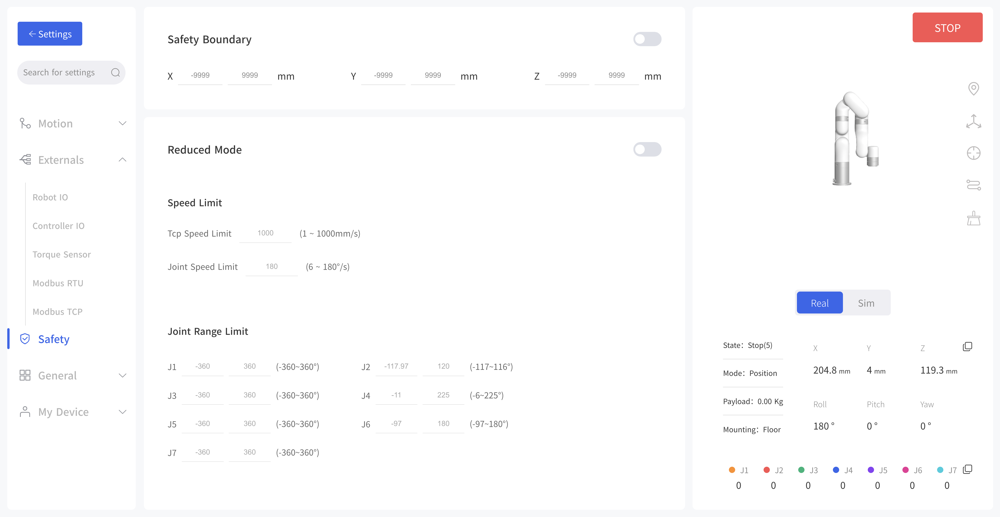

### 6.3.1 Safety Boundary
When this mode is turned on, the working range of the robotic arm in Cartesian space can be limited. If the tool center point (TCP) of the robotic arm exceeds the set safety boundary, the robotic arm will stop moving. The user can then adjust the robotic arm back into the restricted space.

### 6.3.2 Reduced Mode
When this mode is turned on, the maximum linear speed, maximum joint speed, and joint range of the robotic arm in Cartesian space will be limited.

## 6.4 General
### 6.4.1 Assistive Features
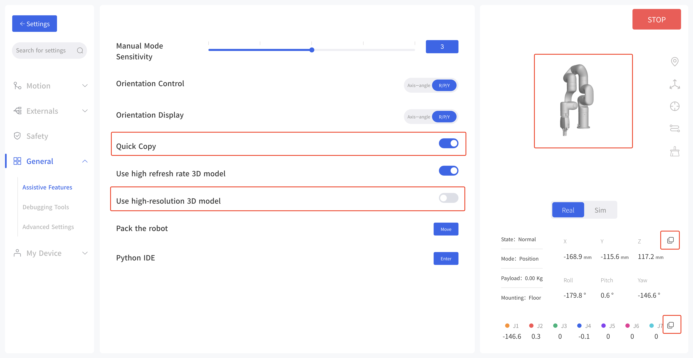
**Manual Mode Sensitivity:** Adjust manual mode  
**Orientation Control:** xArm supports adjusting the rotation of the robot arm through the axis-angle and R/P/Y. Generally, it is recommended to use the axis-angle since the axis-angle control is more intuitive. The choice here determines the TCP control mode of the UFactory studio Live Control page. The left side of the figure below is the axis-angle control, the button is displayed as Rx/Ry/Rz; the right side is the R/P/Y control, and the button is displayed as R/P/Y.
**Orientation Display:** Similar to orientation control.
**Quick Copy:** After turning on this button, the TCP coordinates and joint angle values of the xArm can be copied on the real-time control interface.
**Use high refresh rate 3D model:** switch to high refresh rate 3D model.
**Use high-resolution 3D model:** Switch to high-resolution 3D model.
**Pack the robot:** Move the robotic arm to pack position.
**Python IDE:** Enter into python IDE module.

### 6.4.2 Debugging Tools
This page can help technical support remotely analyze and solve problems by observing changes in some parameter values of the robotic arm and drawing graphics to technical support. You can also check the record CSV and download it after the observation and send it to technical support.    

**Robot**

Data Item:
* Target Joint Positions
* Target Joint Velocities
* Target Joint Accelerations
* Actual Joint Positions
* Actual Joint Velocities
* Actual Joint Accelerations
* Actual Joint Currents
* Estimated Joint Torques
* Target TCP Pose
* Target TCP Speed
* Actual TCP Pose
* Actual TCP Speed
* Estimated TCP Torques

**Joint**
Click 'unlock' to unlock a single joint. The unlocked joint does not have any force to provide and thence external force support is needed. At this time, the joint can be dragged by hand to rotate. After confirming the position, please re-lock all the joints manually.     
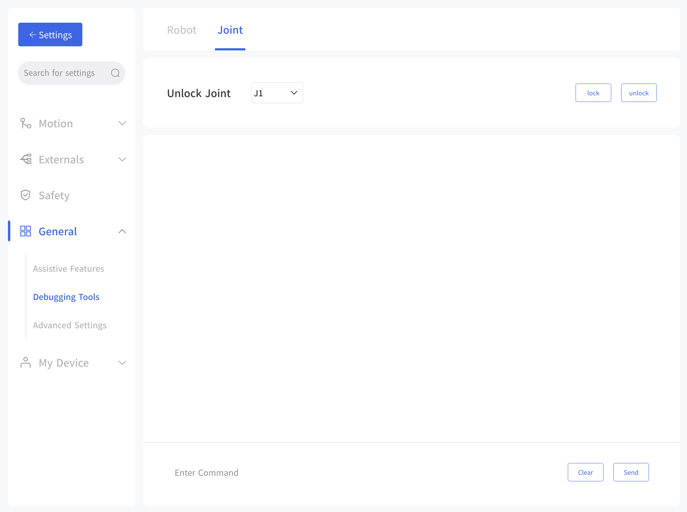
* Please ensure to hold the robotic arm by hand when unlocking the joint to prevent it from falling down due to the inadequate provision of force, and take measures to protect the surrounding environment and peripheral facilities.
* The operation of the unlocking joint is mainly used to adjust the posture of the robotic arm to a relatively safe position when the error is reported by the robotic arm. Attention should be paid to adjusting the joint into the range manually when it exceeds the range of the joint.
* In the 'simulated robotic arm mode', clicking the unlock joint button will also unlock the real joints of the robotic arm.

**DANGER:
When releasing the joint brakes, someone must support the robot's posture to prevent the robotic arm from falling without external force and damage the robotic arm and surrounding equipment.**

**CAUTION:
After the release of the joint brake and manually dragging the robotic arm, please always pay attention to the degree of joint rotation to avoid exceeding the rotation range of the robot joint and damage the internal structure of the robotic arm.**

### 6.4.3 Advanced Settings
  
You must enter password to access this page, the default password: admin.
**Joint Jerk:** 6~28647, the default is 11459°/s³.
**TCP Jerk:** 1~100000, the default is 7000mm/s³.  
* The jerk affects the acceleration performance of the robotic arm. In general, we do not recommend modifying this parameter.  
* If the robotic arm is not enabled, the jerk cannot be modified.
* If an error warning occurs on the robotic arm, the jerk cannot be modified.
* When the robotic arm is moving, the jerk can not be modified.
  

**Clear the IO output when the robot is stopped**: The robotic arm will be reset to the default status after sending STOP command.  
* Configurable Output(CO0~CO7), Digital Output(DO0~DO7)
* Tool Digital Output(TO0/TO1)

**Collision Rebound:** When this mode is turned on, the robotic arm will rebound backward for a certain distance after it collides with an obstacle.  If collision Detection is open, when this mode is turned off, the robotic arm will stay at the position where collision is detected.
**Collision Detection:** Turn on/off collision detection
**Self-collision detection:** When the mode is turned on, it will prevent the xArm from causing self-collision.
**Use Approximate Solution:** Use approximate solution to pass Singularities.
**Cartesian velocity continuous:** Set cartesian velocity continuous.
**Export:** The robotic arm parameters that can be exported mainly include: motion parameters, TCP offset, TCP payload, IO settings, safety boundary, installation methods, coordinate systems, and advanced parameters.
**Import:** Import the configuration file containing the parameters of the robotic arm.  
**Factory Reset:** The robotic arm will restore the factory settings.

**Note:**
* When multiple robotic arms need to share a set of configuration parameters, click the 【Export】button to export the configuration file of a robotic arm that has been set. Then click the 【Import】button to import the configuration file to other robotic arms.  
* When the control box fails and needs to be repaired, you can export and save the configuration file of the robotic arm to prevent the original data from being lost or changed during the repair process.
* The parameters of the robotic arm will change after the factory reset. Please export the configuration file of the robotic arm before the factory reset.

## 6.5 My Device

### 6.5.1 Device Info
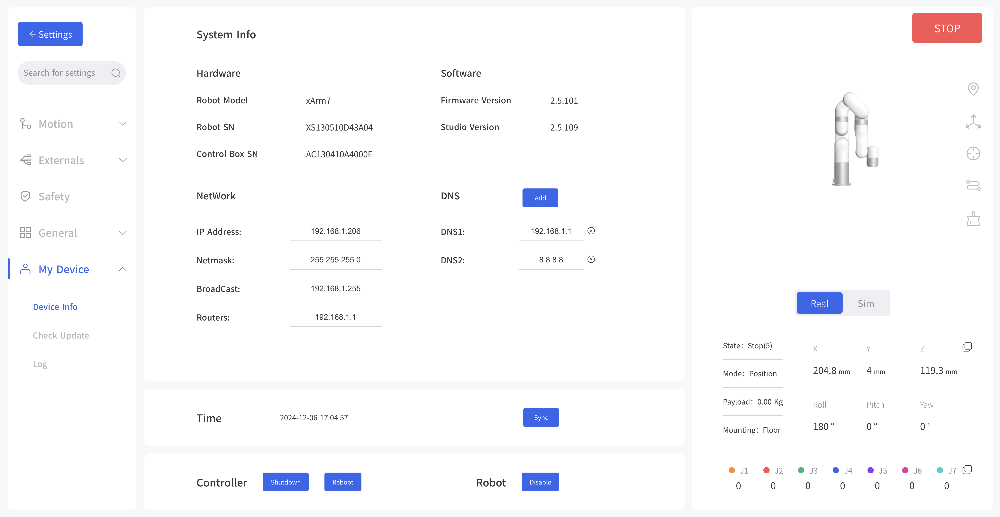
Display the IP address of the connected robotic arm, the firmware version of the arm, and the UFactory studio software version, the degree of freedom (number of axis) of the current robotic arm,and SN address of the robotic arm can be checked.

**Network Settings：** Display the IP address of the robotic arm, subnet mask, broadcast address, and default gateway. The DNS address can be modified and added.

**Note:** 
If you change the IP address, be sure to mark it on the control box. If you forget or lose the modified IP address, you can use the following method to reset the IP.

***
How to reset IP？  
Steps:
* 1.Press the emergency stop button and turn off the power of the control box.
* 2.Connect RI0 to GND with a cable.
  
* 3.Turn on the power of the control box. After hearing the sound of "beep", it means that the IP address of the control box has been reset successfully. The reset IP **is 192.168.1.111.**
* 4.Please unplug the cable connecting RI0 and GND and wait for the control box to start up (60 seconds).
* 5.Enter 192.168.1.111:18333 in the browser to access UFACTORY Studio.
***

### 6.5.2 Check Update

**Check Update:** Click to get the latest UFactory studio and xArm firmware version information for your controller.
**Install:** Click to go to the offline installation window for UFactory studio and xArm firmware, select the upgrade package you downloaded in advance to update the firmware and studio to the latest.

### 6.5.3 Log
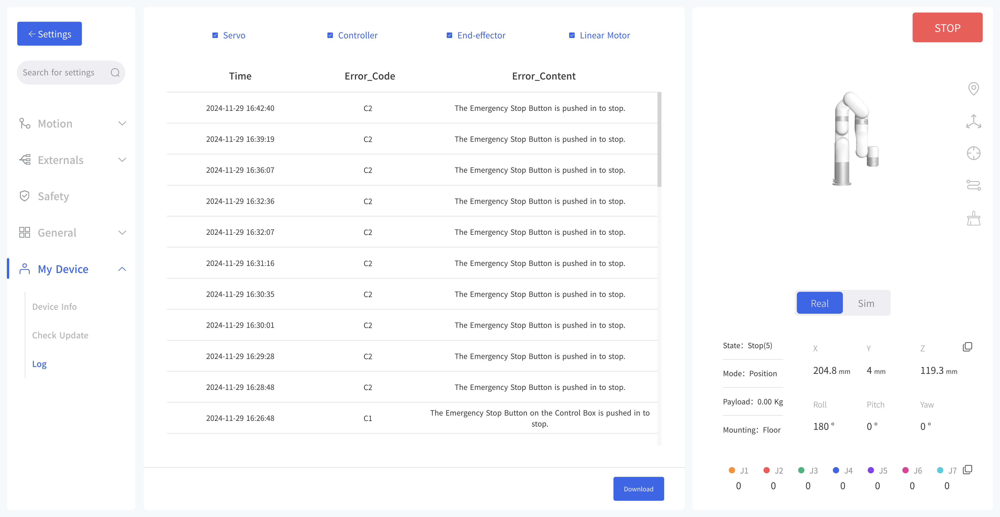
The error log of the control box, servo error log and end effector error log can be checked.
Click the 'Download' button to download the error log.
