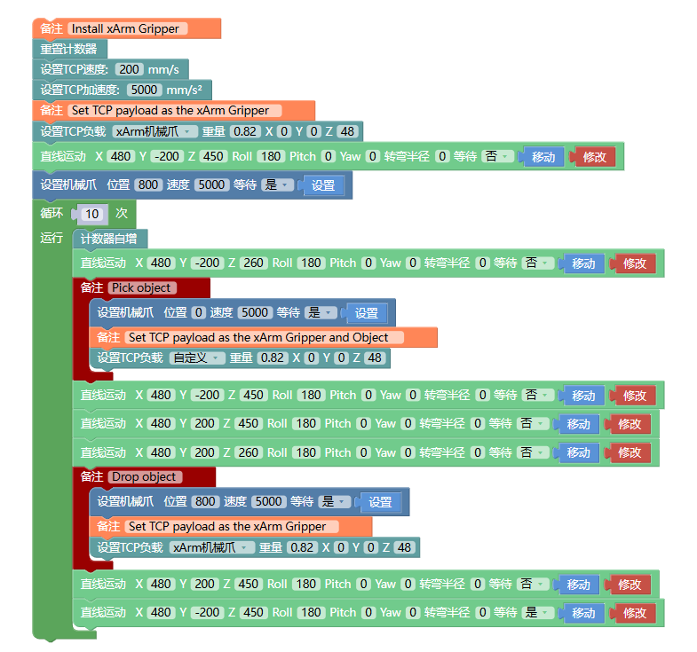
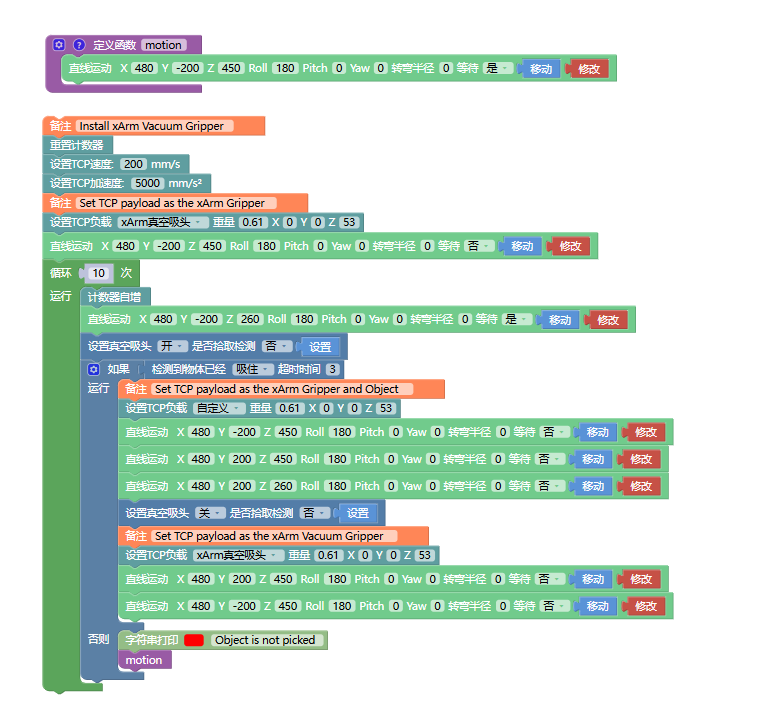
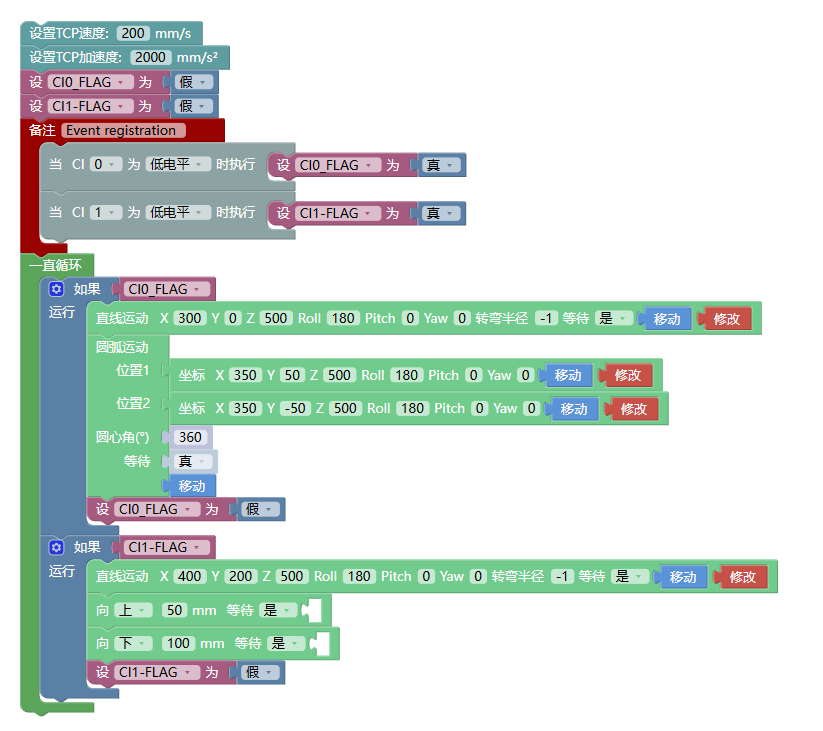

# 7. Blockly典型示例  

在UFactory Studio中Blockly内置了几个例子，可以参考例子进行编程。下面介绍其中几个较有代表性的例子。
## 7.1 xArm机械爪的使用
该Blockly程序在示例程序[UF] - 1007_xArm_Gripper。
  
这段程序的作用：执行此程序，可控制机械爪在指定位置夹取目标物，然后将目标物放到特定的位置。  
设置TCP负载：该指令在上述程序中使用多次，其主要目的是**动态改变负载**，适应机械臂在夹取和释放物体的过程中TCP负载的变化。

## 7.2 xArm真空吸头的使用
该Blockly程序在示例程序[UF] - 1008_xArm_Vacuum_Gripper。
  
这段程序的作用：执行此程序，可控制真空吸头在指定位置吸取目标物，然后将目标物放到特定的位置。
* 定义的函数要放在主程序的前面，如上图所示。
* 主要指令：
**设置真空吸头（开/关）**：可设置真空吸头开启和关闭状态。
* 是否拾取检测=是，同时检测了是否吸住物体，如果没有吸住物体，将会跳出整个程序；
* 是否拾取检测=否，不检测是否吸住物体。
**检测真空吸头已经（吸住/释放）**：检测真空吸头是否吸住（释放）物体，若检测到真空吸头已吸住（释放）物体，则跳出这条指令，执行下一个指令，如果超过了超时时间后，真空吸头还未吸住（释放）物体，则也会跳出该指令，执行下一个指令。
**循环运动计数：** 通过添加计数器自增，机械臂每次执行到该指令时会使控制器的计数器自增1。可用于计算机械臂实际循环执行的次数。
**重置计数器：** 该指令将控制器内的计数器重置为0。

## 7.3 控制器数字IO的使用
该Blockly程序在示例程序[UF] - 1010_Ditital_IO。
  
这段程序的作用：可以通过触发数字IO，来执行相应的运动。CI0和CI1默认为低电平，当程序检测到CI0或CI1**跳变**为高电平时，改变变量值，从而触发一直循环中的如果事件，触发后重置变量值，达到触发一次CI则运行一次相应动作的效果。