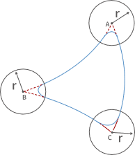
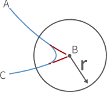
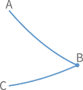
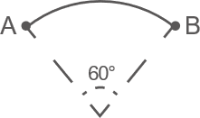
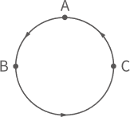
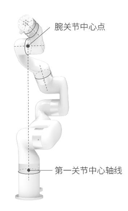

# 8. 运动学特性

## 8.1 机械臂的运动方式
### 8.1.1 关节运动  
实现关节空间的点对点运动（单位：度），每个指令之间速度不连续。  

* Wait参数：表示是否等待该命令执行完后再发送下一条命令。
* 移动：机械臂会运动到当前位置点。
* 修改：打开实时控制界面，调节当前点的坐标。

上例中机械臂的运动轨迹如下：  
  

Python示例：
~~~python
arm.set_servo_angle(angle=[0.0, 7.0, -71.2, 0.0, 0.0, 0.0], speed=8, mvacc=1145, wait=True)

arm.set_servo_angle(angle=[0.0, 7.0, -51.2, 0.0, 0.0, 0.0], speed=8, mvacc=1145, wait=True)

arm.set_servo_angle(angle=[0.0, 7.0, -91.2, 0.0, 0.0, 0.0], speed=8, mvacc=1145, wait=True)
~~~
&ensp;&ensp; set_servo_angle参数说明：
* `servo_id`：关节ID，None或8代表所有关节
* `angle`：关节角度或关节角度列表（默认关节角度单位为`is_radian=Flase`，即度）
* `speed`：关节速度。
* `mvacc`：关节加速度。
* `is_radian`：关节角度单位是否为弧度。
* `wait`：True：等待当前指令发完再发下一条指令；&ensp;&ensp; False：不等待，直接发下一条指令。
* `mvtime`：0，运动时间，暂无意义。
***
如何规划连续的关节运动？  
两条关节运动指令之间插入圆弧过渡，是规划机械臂进行连续的关节运动的一种方式。
 

上例中机械臂的运动轨迹如下：  

**关键参数说明**
 **Radius=60**
`move joint`指令中的`Radius=60`，指设置的过渡圆弧的半径R= 60mm，用于实现关节运动转弯的平滑过渡。
`Radius`的参数可设置为 `Radius>0, Radius=0, Radius=-1`, 不同参数对应不同的轨迹。
* **`Radius>0：`** 例如设置Radius=60，转弯的轨迹如下图蓝色圆弧，可以实现平滑转弯效果。  

* **`Radius=0：`** 转弯处不设置圆弧过渡，尖角转弯，如下图所示。

* **`Radius<0：`** 转弯处不设置圆弧过渡，尖角转弯，如下图所示。
 

**总结：**  
`move joint`指令中的wait表示是否需要等待本条指令执行完再发送下一条指令。  
如果需要规划连续运动，请确保 `wait=false, Radius≥0` 。  
* 关节速度在交融区域是平滑过渡的，交融部分执行的时间是不交融两段轨迹时间的一半， 所以如果关节运动交融半径比较小，速度提升感不会十分明显。
* 设置的Radius的值应该小于DAB和DBC（直线距离）。
***
### 8.1.2 直线运动  
实现笛卡尔坐标之间的直线运动（单位：mm），每个指令之间速度不连续。  

用户可以基于基坐标系、TCP坐标系来控制机器人运动状态。笛卡尔空间运动的机器人使工具在路点之间进行线性移动。这意味着每个关节都会执行更为复杂的移动，以使工具保持在直线路径上。目标点确认后，末端路径是唯一的，轨迹过程中对应的姿态是随机的。基坐标系的X、Y 和 Z 控制工具的位置，箭头指向为+方向，单位是mm。TCP坐标系的Roll /Pitch/Yaw控制工具的方向，单位是度。      

直线运动和圆弧直线运动属于笛卡尔空间轨迹规划，需要做逆运动学求解。因而可能存在无解、多解、逼近解的情况；而且由于关节空间和笛卡尔空间的非线性关系，可能会出现轴动运动超出其最大速度和加速度限制的情况。  

  

Python示例：
~~~python
arm.set_tcp_jerk(2000)

arm.set_position(x=205.0, y=100.0, z=110.4, roll=180.0, pitch=0.5, yaw=0.0, speed=100,  radius=-1.0, wait=True)

arm.set_position(x=205.0, y=120.0, z=110.4, roll=180.0, pitch=0.5, yaw=0.0, speed=100,  radius=-1.0, wait=True)

arm.set_position(x=205.0, y=140.0, z=110.4, roll=180.0, pitch=0.5, yaw=0.0, speed=100,  radius=-1.0, wait=True)
~~~

&ensp;&ensp;  如果需要规划连续直线运动，请确保**`wait=false, Radius≥0`**。

**&ensp;&ensp;  注意：** 若为xArm5，则roll和pitch必须设置为roll=±180°，pitch=0°。

### 8.1.3 圆及圆弧运动
圆弧运动根据三点坐标计算出空间圆的轨迹，三点坐标分别为（起点,位置1,位置2）。  
以当前点为起点，再设置两个位置点，三点确定一个圆。

**圆心角的设置：**
* **若0< 圆心角<360°或圆心角>360°：** 则机械臂的运动路径为相应度数的圆弧；
&ensp;&ensp; 若圆心角=60°，机械臂的运动轨迹为：

* 圆心角（°）=360°，则机械臂可完整走完一整个圆弧；
* 若想连续画多个圆弧（例如，连续画10段圆弧），则将圆心角设置为所画圆弧度数的十倍。

![[blockly_circle_1_cn.png]](assets/blockly_circle_1_cn.png)
* 起点，位置1和位置2确定一个整圆的三个参考点，若机械臂的运动路径为一段圆弧，则位置1 和位置2不一定为终点或者经过点；
* 若想让机械臂在运动过程中实现姿态变化，请将位置2的roll、pitch、yaw设为完成轨迹时的期望姿态；
* 圆心角（°）：表示该圆弧的度数，设置360°时可以走完一整个圆弧，可大于小于360°；

**示例讲解：**
&ensp;&ensp; 在此示例中，圆心角设置为3600°，代表每次可连续画十个圆，且机械臂每画完一个圆，还是停留在起点的。
&ensp;&ensp; 上例中起点，位置1和位置2分别为：
A（300,0,400,180,0,0）B（350,50,400,180,0,0）C（350,-50,400,180,0,0）
* 机械臂以顺时针方向画圆，机械臂运动轨迹的方向如下图：
![[blockly_circle_3_cn.png]](assets/blockly_circle_3_cn.png)
* 如果将B点和C的位置交换，B点为（350,-50,400,180,0,0），C点为（350,50,400,180,0,0），则机械臂的将以逆时针方向画圆，机械臂运动轨迹如下：  

Python示例：
~~~python
arm.set_servo_angle(angle=[0.0, -45.0, 0.0, 0.0, -45.0, 0.0], speed=20, mvacc=500, wait=True)        

arm.set_position(*[300.0, 0.0, 400.0, 0.0, -90.0, 180.0], speed=300, mvacc=2000, radius=-1.0, wait=True)  

move_circle([350.0, 50.0, 400.0, 180.0, -90.0, 0.0], [350.0, -50.0, 400.0, 180.0, -90.0, 0.0], 1000.0, speed=300, mvacc=2000, wait=True)
~~~
## 8.2 xArm5运动特性
**笛卡尔空间**  
xArm5的运动比较特殊，由于结构限制，笛卡尔空间的直线、圆弧运动实际灵活自由度为4, 即[x,y,z,yaw]，类似四自由度的SCARA机械臂。在开始笛卡尔控制之前，需要保证xArm5处于末端法兰面与底座完全水平的姿态，此时roll和pitch应为 [±180度，0度]，否则轨迹很容易无解。
固件大于2.5.0时，提供**使用近似解**选项，可以解除此限制。  

**关节空间**  
在关节空间时，机械臂有5个自由度可以控制，在需要末端使用其他姿态的情况下，可以切换至关节指令。而后再次使用关节指令回到法兰与底座水平的姿态即可以切换回笛卡尔控制。将J4的角度设为-(J2角度+J3角度)，从而调平末端。
## 8.3 奇异点
***
什么是奇异点？  
当机械臂的的任意两个关节的轴心处于同一直线时会出现奇异点。处于奇异点时,机器人自由度将发生退化，将会造成某些关节角速度趋于无穷大，导致失控。常见情况是，当腕关节（倒数第2个关节）处于或接近第一关节轴线时，也会出现奇异点（见图8.5），因而尽量避免直接经过靠近基座中心区域的笛卡尔轨迹，容易造成1关节速度过大。

***

**特性：**  
奇异点的特性为无法正确的进行规划运动。基于坐标的规划运动无法明确的反向转化为各轴的关节运动。机器人在奇异点附近进行规划运动（直线、圆弧等，不包括关节运动）时会报警停止，以避免通过奇异点时造成关节瞬间速度过快，所以示教时应尽量避开奇异点或以关节运动通过奇异点。

**如何处理奇异点？**
情况一：在机器人示教时遇到奇异点
* 将机器人的示教坐标系切换到关节。

情况二：在程序运行时遇到奇异点
* 打开[使用近似解](#书签13：使用近似解)选项
* 当运行程序时遇到奇异点，可以修改机器人的位置姿态，以避开路径当中存在的奇异点，重新进行到达目标点的路径规划。

注意：  
选择机械臂安装位置时，务必考虑机械臂正上方和正下方的圆柱体空间（如下图）。尽可能避免将机械臂腕关节（J5）移向圆柱体空间，因为这样会造成机械臂慢速运动时关节运动超速，从而降低机械臂的工作效率，且风险评估难以进行。
