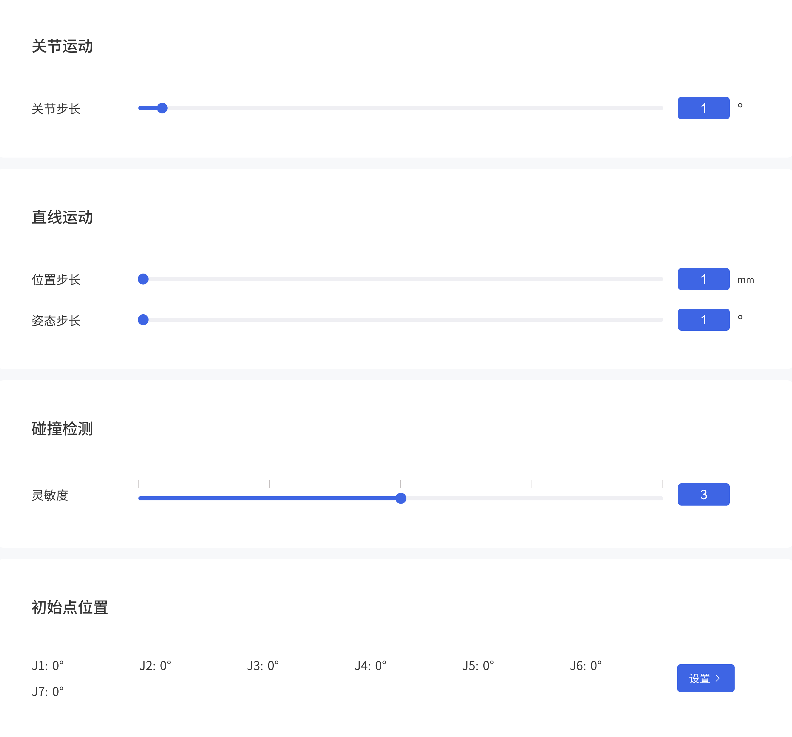
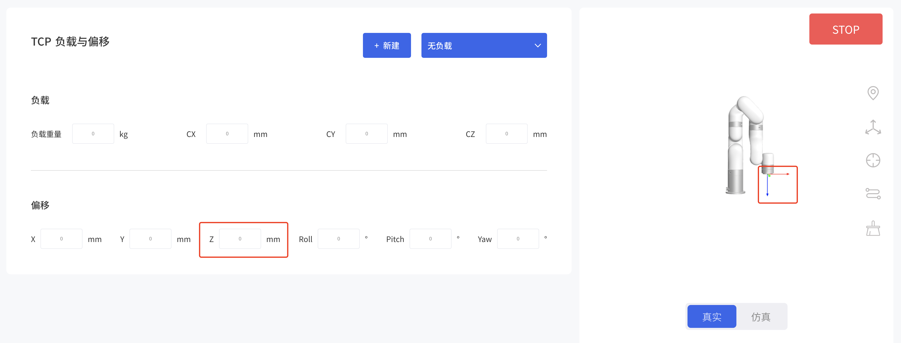
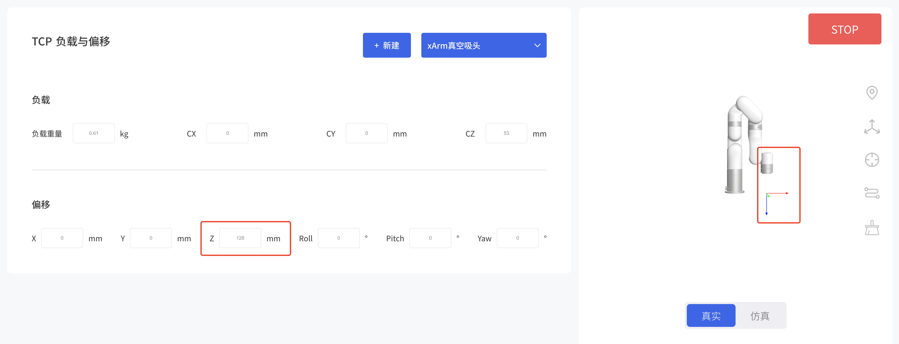
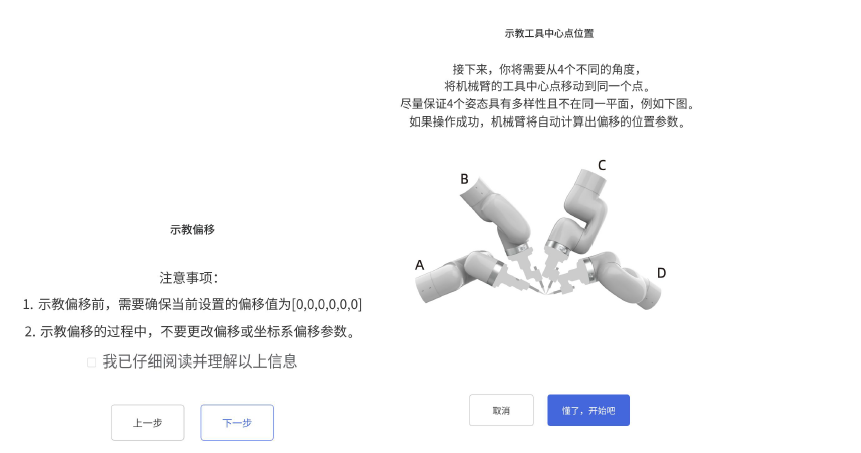
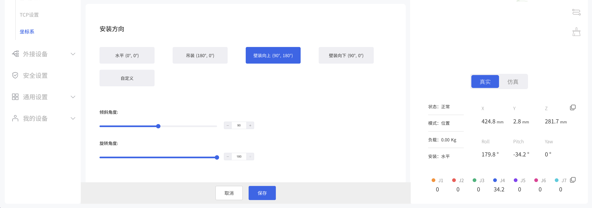
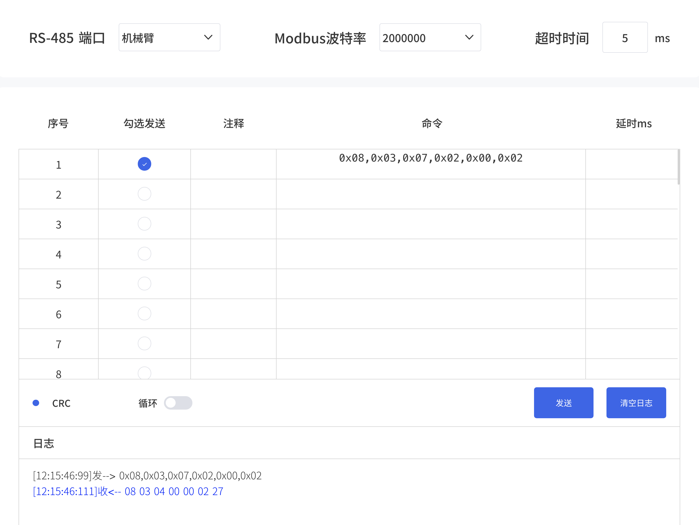
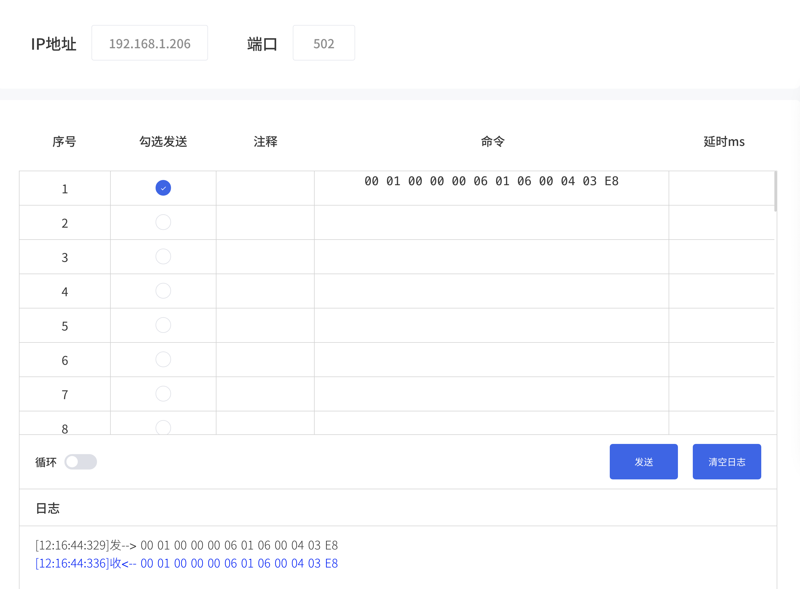
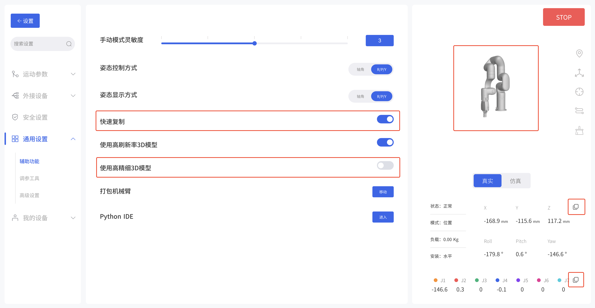
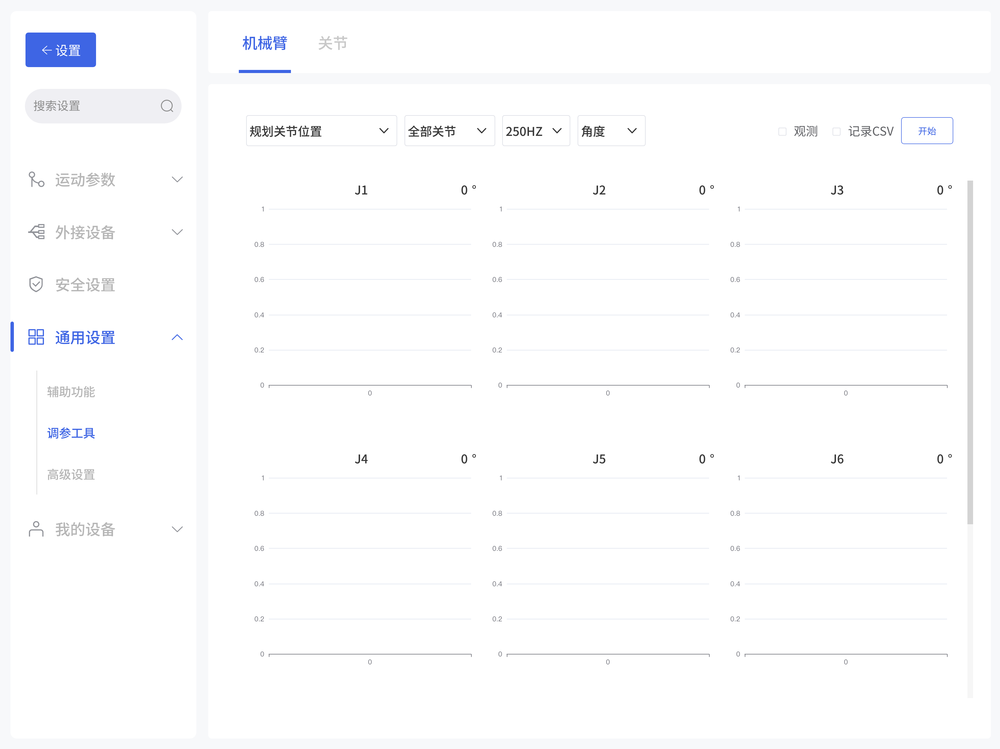
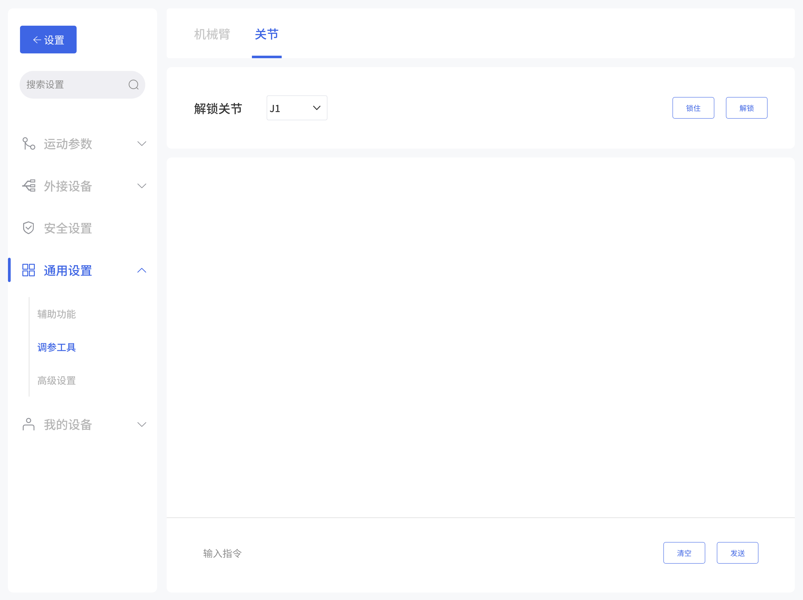

# 6. 设置界面

## 6.1 运动参数
### 6.1.1 基础参数

**关节步长：** 设置单关节旋转的步进值，对应点动板的关节运动。

**位置步长：** 设置笛卡尔空间坐标系X/Y/Z轴的步进值，对应点动板的直线运动。

**姿态步长**：设置笛卡尔空间坐标系Roll/Pitch/Yaw的步进值，对应点动板的直线运动。

**碰撞检测**：机械臂运动过程中，检测到的力矩和理论力矩超过一定范围时，机械臂会立刻停止。碰撞灵敏度等级为1-5，等级越高，手臂越灵敏，触发碰撞保护所需的外力越小。请设置正确负载和安装方式，否则容易触发碰撞保护。在某些高负载和高速运动时，可能会误报，建议将碰撞灵敏度调低，但不建议将其调到3以下。

**初始点位置**：设置机械臂初始点，可帮助用户在规划轨迹时，使机械臂回到相对安全的位置。该位置设置的初始点即为实时控制界面初始点按钮的位置。点击设置按钮，软件自动跳转自实时控制界面，将手臂移动到想要设置的初始点，点击保存按钮。
### 6.1.2 TCP设置
&ensp;&ensp;查看手臂当前的TCP负载和偏移，并根据实际情况设置TCP负载和重心偏移。

**TCP负载：** 指实际的（末端执行器+工件）的重量，单位是kg；X/Y/Z轴表示TCP的重心位置，单位是mm。当末端实际没有任何负载时，TCP负载和重心均要设置为0.

**TCP偏移：** 设置TCP（末端执行器）坐标系与定义在法兰中心的工具坐标系之间的相对偏移，单位是mm。如图上B点TCP偏移，位置坐标X,Y,Z决定了TCP的位置，而Roll，Pitch，Yaw决定了其方向。当指定的值均为0时，TCP与工具法兰的中心点重合。

在该页面可设置机械臂当前负载和记录备用负载数据，并在Blockly编程时引用。

**默认TCP负载和偏移：[kg,Cx,Cy,Cz][x,y,z,roll,pitch,yaw]**  
* 无负载：[0,0,0,0]，[0,0,0,0,0,0]
* xArm真空吸头：[0.61,0,0,53]，[0,0,126,0,0,0]
* xArm机械爪：[0.82,0,0,48]，[0,0,172,0,0,0]
* xArm BIO机械爪：[0.72,22.39,3.22,23.55]，[159.5,0,59.5,0,0,0]
* Robotiq-2F-85机械爪：[0.925,0,0,58]，[0,0,174,0,0,0]
* Robotiq-27-140机械爪：[1.025,0,0,73]，[0,0,244,0,0,0]

**新建负载和TCP偏移：**
* 方式一：手动输入。
用户知道负载的重量和负载重心，点击新建按钮后，选择手动输入。负载重心以工具坐标系（如上图点B）为基点设置。  
注意：新建负载的名称一旦确定后，不能更改名称。选择新建的负载，可点击删除，系统默认的负载无法删除。

  

* 方式二：机械臂自动辨识。
手臂必须水平安装。点击自动辨识，手臂自动进行一系列动作计算出TCP负载参数，如下图，此时请确保机械臂附近设备和人员的安全。TCP负载设置完成后，点击下一步，点击自动辨识按钮，开始TCP负载自动辨识。  
此步骤通过示教4个点来获取偏移参数。

### 6.1.3 坐标系

**基坐标系：** 可设置基坐标系偏移来自定义用户坐标系，如图A点基坐标系，XYZ是相对于自定义用户坐标系依次偏移的坐标值，RPY是相对于自定义用户坐标系旋转的角度值，是以一定的顺序绕自定义用户坐标系旋转三次得到的方位。

**新建基坐标系：**
* 方式一：手动输入
* 方式二：示教获取，通过示教4个点，来获取用户坐标系参数。
  
  
&nbsp;&nbsp;&nbsp;&nbsp;&nbsp;&nbsp;A：基坐标系&nbsp;&nbsp;&nbsp;B：TCP坐标系&nbsp;&nbsp;&nbsp;C：用户坐标系     

**示例：**  
在坐标系{A}下： B(207,0,112,180,0,0) DAC  = 1000mm  
如果用户想要设置坐标系{C}为参考坐标系，则需要在用户坐标系{C}下来表示坐标系{A}的方位。 
则：如图所示，基坐标系的偏移应为(1000,0,0,0,0,180)  
TCP坐标由：B(207,0,112,180,0,0) 变为B'(793,0,112,180,0,180)

**安装方向：**   
设置机械臂的安装方式，告知控制器当前机械臂的实际安装方向与重力方向的关系。如果机械爪安装方式设置不正确，机械臂将无法准确识别重力方向，会导致机械臂频繁触发碰撞检测，还将导致机械臂进入手动模式后触发“手动模式运动异常”的报错。  
对于SN为XF1300/XI1300/XS1300及更新版本的机械表，机械臂内置的IMU（惯性测量单元）会检测重力方向，当您设置的安装方向与IMU检测的安装方向偏差超过10°时，软件会弹出错误提示。
  
主要参数：倾斜角、旋转角

***

如何确认倾斜角和旋转角？
![[settings_coor_3_cn.png]](assets/settings_coor_3_cn.png)
&ensp;&ensp;机械臂的初始位置点：在水平线上，机械臂零点姿态下，人面向机械臂时，机械臂末端在人的左手边且指向斜面向下方向为初始位置点。
* **倾斜角：** 机械臂的初始位置点与实际要安装的机械臂的底座夹角作为倾斜角，其范围是0~180°。
* **旋转角：** 机械臂初始位置点到机械臂实际要安装的末端方向间的旋转角度作为旋转角。

&ensp;&ensp;旋转角±方向的确定方法：右手握紧，拇指指向垂直于安装斜面机械臂机身的方向，四指指向为正方向，反之为负方向。旋转角范围是±180°。
  

**危险：**
* 1.确保机械臂根据实际情况，使用正确的安装方式。
* 2.必须安装在坚固防震的表面，避免机械臂出现侧翻的危险。

***
## 6.2 外接设备
### 6.2.1 机械臂IO  
此页面可监测机械臂末端数字输入、模拟输入，并设置机械臂数字输出。   
更新频率：5HZ  
数字输入：TI0、TI1， 默认为0-低电平。  
数字输出：TO0、TO1。  
机械臂模拟输入：TAI0、TAI1，默认为0V，最高为3.3V。

### 6.2.2 控制器IO
根据控制器类型，xArm(>=1300版本控制器)/UF850显示32路数字输入输出，Lite6显示16路数字输入输出，只有当IO设置为通用输入/输出时，才可在Blockly项目和SDK中做自定义设置，否则改自定义设置不生效。

#### **IO状态：**   
该页面可以查看数字输入、数字输出、模拟输入、模拟输出的状态，可以设置数字输出、模拟输出。  
数字输入：CI0-CI7、DI0-DI7，默认为1-高电平。  
数字输出：CO0-CO7、DO0-DO7，默认为0-低电平。  
控制器模拟输入：AI0、AI1。   
控制器模拟输出：AO0、AO1，默认为0V，最高为10V。

#### **IO功能：**  
**输入配置：**  
CI0-CI7：通用输入、停止运动、防护重置、离线任务、手动模式、缩减模式、使能机械臂。  
DI0-DI7：通用输入、离线任务、手动模式、使能机械臂。  
**通用输入：**   控制器输入只有被设置为通用输入时，用户才可以在Blockly或SDK程序中自定义使用该IO，否则会导致功能冲突。例如，CI0如果被配置为离线任务，则在任何程序中，都不应再使用CI0。  
**停止运动：** 触发IO，则机械臂立即停止运动。  
**防护重置：** 触发IO，是处于防护停止状态的机械臂恢复运动。需要配合SI使用。  
**离线任务：** 离线任务可添加多个Blockly项目，实现脱离电脑与网络连接，通过触发IO运行项目。如上图所示，CI0设置为离线任务，并添加了Blockly项目。点击添加按钮添加Blockly/Python项目，点击x删除项目。  
**手动模式：** 设置为示教模式，输入信号**持续**为低电平时可自由拖拽机械臂。  
**缩减模式：** 触发IO，机械臂进入缩减模式。  
**使能机械臂：** 通过触发IO来使能机械臂。  
**输出配置：** CO0-CO7/DO0-DO7：通用输出、运动停止、运动中、有错误、有警告、发生碰撞、手动模式生效、缩减模式生效、离线任务进行中、机械臂已使能、紧急停止按钮被按下。  
**通用输出：** 控制器输出只有被设置为通用输出时，用户才可以在Blockly或SDK程序中自定义使用该IO，否则会导致功能冲突。例如，CO0如果被配置为运动停止，则在任何程序中，都不应再使用CO0。  
**运动停止：** 手臂进入紧急停止状态，输出高定平。符合该紧急停止的动作有： 
* 1.控制器急停按钮被按下，机械臂电源切断。 
* 2.通过控制器输入(CI)进入紧急停止。
* 3.通过软件中红色STOP按钮和Blockly中紧急停止代码块。 
* 4.SDK中的set_state(4)。  

**运动中：** 机械臂在运动状态时，输出高电平。  
**有错误：** 机械臂有错误时，输出高电平。  
**有警告：** 机械臂报碰撞错误时，输出高电平。  
**发生碰撞：** 机械臂报碰撞错误时，输出高电平。  
**手动模式生效：** 手动模式开启时，输出高电平。  
**缩减模式生效：** 缩减模式开启时，输出高电平。  
**离线任务进行中：** 机械臂在运行离线任务时，输出高电平。  
**机械臂已使能：** 机械臂已使能时，输出高电平。  
**紧急停止按钮被按下：** 控制器上急停按钮被按下时，输出高电平。

### 6.2.3 力矩传感器
  
**是否安装六维力矩传感器：** 使用所有力矩功能前，需要打开此按钮，和力矩进行通信连接。  
**负载辨识：** 机械臂做一系列动作，识别出当前末端负载质量，质心，偏移量的参数。  
**手动模式方向：** 只能选平移或旋转，不可同时选择。 例如，选择平移，选择XY， 点击激活，此时可沿XY方向拖动手臂。

### 6.2.4 直线滑轨
### 6.2.5 Modbus RTU  
用户可以调试机械臂末端Modbus RTU和控制器Modbus RTU，仅支持**标准Modbus RTU**协议的设备，若不支持标准Modbus RTU，请使用SDK进行控制。  
以调试机械臂末端Modbus RTU获取机械爪的位置信息为例：

* RS-485端口：选择机械臂。
* Modbus波特率：选择2000000（出厂默认）。
* 在命令框中输入指令，例如 0x08,0x03,0x07,0x02,0x00,0x02，软件会自动加上CRC校验。
* 勾选指令，点击发送。
* 在日志框中可看到发送和回复的数据。    

如需循坏发送，需设置延时，勾选指令，开启循环按钮后，点击发送。
超时时间：1~9999ms。  
Modbus波特率：4800, 9600, 19200, 38400, 57600, 115200, 230400, 460800, 921600, 1000000, 1500000, 2000000（默认）, 2500000
### 6.2.6 Modbus TCP
用户可发送标准Modbus TCP指令，IP地址默认为手臂IP，端口默认为502, 均不可修改。  
输入命令后，勾选发送，点击发送，可在日志中看到发送和返回的数据。  
以发送Modbustcp指令触发Blockly项目为例：  
Modbus TCP寄存器定义请参考：[Modbus TCP寄存器](https://docs.ufactory.cc/modbustcp_cn)    

例如下图： 
发送00 01 00 00 00 06 01 06 00 04 03 E8，将控制器模拟输出AO1设置为1V。

## 6.3 安全设置

### 6.3.1 安全边界
该模式被激活后，可以限制机械臂笛卡尔空间的边界范围，如果工具中心点（TCP）超出设置的安全边界，机械臂将停止运动，此时用户可将机械臂回归初始点或移动到安全边界以内。
### 6.3.2 缩减模式  
该模式被激活后，机械臂的最大TCP速度、关节速度、关节范围将被限制。当在Blockly或python SDK等其他地方设置的速度超过设置的范围时，默认使用缩减模式限制的最大速度。
## 6.4 我的设备

### 6.4.1 辅助功能
**手动模式灵敏度：** 等级为1-5，默认为3。可以调整手动模式下的灵敏度，等级越高，手动模式下拖动手臂所需要的力越小。

**姿态控制方式：** 轴角， R/P/Y。默认为轴角，实时控制页面点动板中显示根据此选项为准。

**姿态显示方式：** 轴角， R/P/Y。默认为R/P/Y，实时控制页面机械臂坐标的显示根据此选项为准。

**快速复制：** 打开该按钮后，可在实时控制界面复制机械臂的TCP坐标和关节角度值。

**使用高刷新率3D模型：** 使用对应3D模型。

**使用高精细3D模型：** 使用对应3D模型。

**打包机械臂：** 长按将机械臂移动到打包位置。  
* xArm：[0,0,0,0,0,0,0]°
* UF850：[0,90,0,0,0,0]°
* Lite6：[180,0,0,0,0,-180]°

**Python IDE：** 点击进入Blockly-Python IDE模块。
### 6.4.2 调参工具
&ensp;&ensp;此页面可通过观测机械臂的一些参数值，进行图形绘制并导入到CSV，方便用户观察并记录。点击开始，开始绘图，希望结束时点击结束按钮，必须点击结束按钮，才可使用Studio软件的其他功能。

**机械臂** 
  
可观测数据：
* 规划关节位置
* 规划关节速度
* 规划关节加速度
* 实际关节位置
* 实际关节加速度
* 实际关节电流
* 电流估算的关节力矩
* 规划TCP位置
* 规划TCP速度
* 实际TCP位置
* 实际TCP速度
* 电路估算的TCP力矩
* 力矩传感器(原始值)
* 力矩传感器(滤波值)
* 关节温度

频率：250HZ、5HZ
单位：角度、弧度
关节：所有关节、单关节

**关节**  
此页面可以通过输入指令的方式对于机械臂进行调参或者查询当前机械臂的相关参数，该功能需要在技术支持的指引下进行，并可以通过页面对机械臂关节进行解锁，从而手动转动关节。

**注意：**
该功能要在技术支持的指导下操作。（联系技术支持：[support@ufactory.cc）](mailto:support@ufactory.cc）)
* 为防止解锁后的关节没有力提供而掉落，**解锁关节时请务必用手托住机械臂**，做好保护机械臂和周边设施的措施。
* 解锁关节操作主要用于当机械臂报错时，可手动把机械臂姿态调整到相对安全的位置。注意超过关节范围时，需手动调整关节到范围内。
* 在“仿真机械臂模式”时，点击解锁关节按钮，也会解锁机械臂的真实关节。

**危险：解锁关节时，必须要有人扶住机械臂，避免机械臂没有外力支撑而坠落，损坏机械臂和周围设备。**  
**注意：解锁关节后，手动拖动机械臂时，要时刻注意关节转动度数，避免超出机械部关节转动范围，损坏机械臂内部结构。**

### 6.4.3 高级设置
  
此页面需要输入密码才能进行访问，默认密码是：admin  
请妥善保管密码，当密码遗忘时，请联系技术支持进行密码重置。
**关节加加速度：** 6~28647，默认为11459°/s³。
**TCP加加速度：** 1~100000，默认为7000mm/s³。
注意：
* 加加速度影响机械臂的加速性能，一般情况下，我们不建议修改该参数。
* 机械臂未使能/有错误/运动情况下，无法修改加加速度。

**机械臂停止状态清空IO输出：** 如果机械臂收到停止指令，则对应选择的以下选项将被设置回默认状态。
* 可配置输出(CO0~CO7)，数字输出(DO0~DO7)：
* 末端工具数字输出(TO0/TO1):

**碰撞回弹：** 当机械臂碰撞障碍物时，机械臂会反向回弹一定的距离。如果碰撞灵敏度不为0，该模式关闭后，机械臂会停留在检测到碰撞的位置。

**碰撞检测：**  检测手臂是否发生了碰撞。

**自碰撞检测：** 当检测到手臂即将发生自碰撞时，软件立刻停止手臂并弹出错误提示。

**使用近似解：** 当手臂遇到奇异点时，会在奇异点轻微调整一下姿态绕开。

**笛卡尔速度连续：** 设置速度连续，不减速到0。

**导出：** 将机械臂的参数以配置文件的形式导出到本地，可以将机械臂的参数以配置文件的形式导出。可导出的机械臂参数主要有：运动参数，TCP偏移，TCP负载，IO设置，安全边界，安装方式，设置的坐标系，高级参数。

**加载：** 从本地加载包含机械臂参数的配置文件。

**恢复出厂设置：** 机械臂将恢复出厂设置的参数。

注意：
* 当需要多台机械臂共享一套配置参数时，可通过导出按钮导出一台已经设置完好的机械臂的参数的配置文件，再将该配置文件通过加载按钮导入其他机械臂即可。
* 当控制器出现故障需要返修时，您可将机械臂的配置文件导出并保存，以免控制器在维修过程中出现原始数据丢失或变更的情况。
* 机械臂在恢复出厂设置后，其参数会发生变化，为了避免恢复出厂设置后，机械臂参数发生变化，请在机械臂恢复出厂设置前，导出机械臂的配置文件参数。
## 6.5 设备信息
### 6.5.1 设备信息
  
在设备信息页面，可对控制器进行重启或者关机操作，查看当前机械臂的轴数，IP地址，固件版本，机械臂SN地址、控制器SN地址和软件版本。

**系统信息：** 显示连接机械臂的地址，机械臂固件版本，UFactory studio软件版本。

**网络设置：** 显示和修改机械臂的IP地址，子网掩码，广播地址，默认网关。可修改和添加DNS地址。**修改网络设置需要重启控制器生效**。

**系统时间：** 显示当前系统时间年月日，可点击同步当前电脑的时间。

**断使能：** 断机械臂使能。

注意：
若更改了IP地址，务必在控制器上做好标注。如果忘记或丢失修改后的IP地址，请参考下面的方法重置IP。
***
如何重置IP？
重置IP步骤：
* 1.按下急停开关，关闭控制器电源。
* 2.用导线将RI0与GND连接。
![[settings_resetip_cn.png]](assets/settings_resetip_cn.jpg)
* 3.开启控制器电源，旋转急停开关，听到“滴”的一声之后，表示控制器IP已经重置成功。重置后的IP 为：192.168.1.111。
* 4.请拔掉连接RI0和GND的导线，等待控制器启动完成（60秒）即可。
* 5.在浏览器内输入IP+:18333访问UFactory Studio，连接机械臂。
***
### 6.5.2 检查更新
![[settings_checkupdate_cn.png]](assets/settings_checkupdate_cn.png)
**检查更新：** 检查到有更新版本，点击下载最新版本固件和Studio的软件包，此步骤需要联网。

**安装：** 点击选中提前下载好的升级包，即可更新固件和studio到最新。
### 6.5.3 日志

&ensp;&ensp;显示伺服、控制器、末端工具、直线滑轨的报错日志。当手臂发生错误时，可点击下载按钮下载详细日志，并发送给技术支持进行分析。